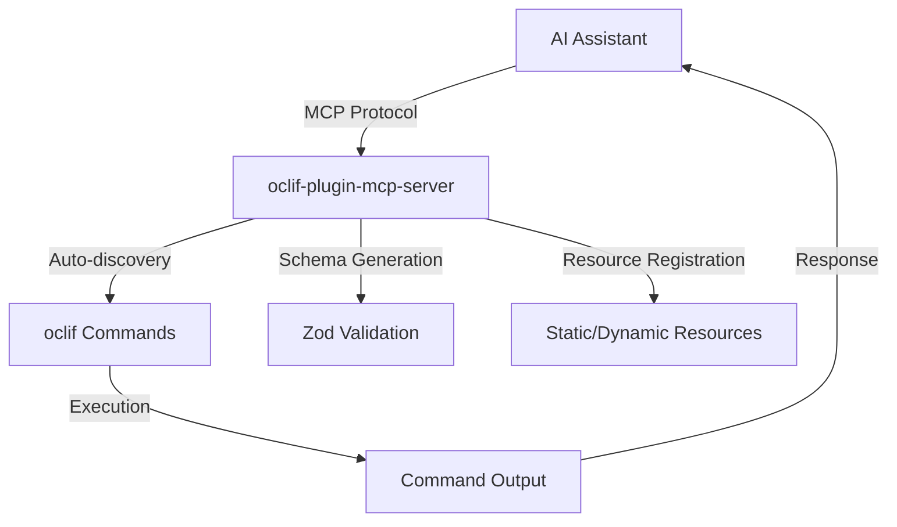

# 🔌 oclif-plugin-mcp-server

> Transform any oclif CLI into an MCP (Model Context Protocol) server for seamless AI assistant integration

[](https://oclif.io)
[](https://npmjs.org/package/plugin-mcp-server)
[](https://npmjs.org/package/plugin-mcp-server)
[](https://github.com/oclif-plugin/plugin-mcp-server/blob/main/LICENSE)

This plugin automatically converts your oclif CLI commands into an MCP server, allowing AI assistants like Claude, ChatGPT, and Cursor to discover and execute your CLI tools naturally through conversation.

## What is MCP?

The **Model Context Protocol (MCP)** is an open standard that enables AI assistants to securely connect to external data sources and tools. With MCP, your CLI becomes a first-class citizen in AI workflows, allowing assistants to:

- 🔍 **Discover** your commands automatically
- ✅ **Validate** inputs using type-safe schemas
- 🚀 **Execute** commands with proper error handling
- 📊 **Access** resources and documentation

<!-- toc -->
* [🔌 oclif-plugin-mcp-server](#-oclif-plugin-mcp-server)
* [Install the plugin](#install-the-plugin)
* [Start the MCP server](#start-the-mcp-server)
* [Set custom log level for npm operations](#set-custom-log-level-for-npm-operations)
* [Set custom npm registry](#set-custom-npm-registry)
* [Your existing CLI](#your-existing-cli)
* [After MCP integration, AI can use these naturally:](#after-mcp-integration-ai-can-use-these-naturally)
* ["Deploy my-app to production with force flag"](#deploy-my-app-to-production-with-force-flag)
* ["Show me the current status in JSON format"](#show-me-the-current-status-in-json-format)
* ["Get the last 100 log entries"](#get-the-last-100-log-entries)
<!-- tocstop -->

## 🚀 Features

- **🔍 Auto-discovery**: Automatically discovers and exposes oclif commands as MCP tools
- **📝 Schema Generation**: Converts oclif arguments and flags to Zod schemas for type-safe execution
- **📊 Resource Support**: Register static and dynamic resources for AI context
- **🛡️ Error Handling**: Graceful error handling with detailed feedback
- **⚡ Zero Configuration**: Works out-of-the-box with any oclif CLI
- **🔧 Flexible**: Support for both static and dynamic resource registration

## 📦 Installation

### As a Plugin (Recommended)

Install this plugin into your existing oclif CLI:

```bash
# Install the plugin
your-cli plugins install plugin-mcp-server

# Start the MCP server
your-cli mcp
```

### Standalone Installation

```bash
npm install -g plugin-mcp-server
plugin-mcp-server mcp
```

## 🎯 Quick Start

### 1. Enable Commands for MCP

Add the `allowMCP` property to commands you want to expose:

```typescript
// src/commands/deploy.ts
import {Command, Flags} from '@oclif/core'

export default class Deploy extends Command {
  static description = 'Deploy your application'
  static allowMCP = true // 👈 Enable this command for MCP

  static flags = {
    environment: Flags.string({
      char: 'e',
      description: 'deployment environment',
      required: true,
      options: ['staging', 'production'],
    }),
    force: Flags.boolean({
      char: 'f',
      description: 'force deployment',
    }),
  }

  static args = {
    app: {
      name: 'app',
      required: true,
      description: 'application name',
    },
  }

  async run() {
    const {args, flags} = await this.parse(Deploy)
    this.log(`Deploying ${args.app} to ${flags.environment}`)
    // Your deployment logic here
  }
}
```

### 2. Configure AI Assistant

Add your CLI to your AI assistant's MCP configuration:

#### Cursor (cursor_settings.json)

```json
{
  "mcpServers": {
    "your-cli": {
      "command": "your-cli",
      "args": ["mcp"],
      "env": {}
    }
  }
}
```

#### Claude Desktop (claude_desktop_config.json)

```json
{
  "mcpServers": {
    "your-cli": {
      "command": "your-cli",
      "args": ["mcp"]
    }
  }
}
```

### 3. Start Chatting

Your AI assistant can now discover and use your CLI commands:

```
👤 "Deploy my-app to staging"
🤖 "I'll deploy your application to staging using the deploy command."

   Executing: deploy my-app --environment staging
   ✅ Deploying my-app to staging
   Deployment completed successfully!
```

## 📚 Advanced Usage

### Custom Tool IDs

Override the default tool ID generation:

```typescript
export default class MyCommand extends Command {
  static allowMCP = true
  static toolId = 'custom-tool-name' // Custom MCP tool identifier
}
```

### Static Resources

Register static resources that AI can access:

```typescript
export default class ConfigCommand extends Command {
  static allowMCP = true

  static mcpResources = [
    {
      uri: 'config://app-settings',
      name: 'Application Settings',
      description: 'Current application configuration',
      content: JSON.stringify(
        {
          version: '1.0.0',
          environment: 'production',
          features: ['auth', 'logging'],
        },
        null,
        2,
      ),
      mimeType: 'application/json',
    },
  ]
}
```

### Dynamic Resources

Register dynamic resources with custom handlers:

```typescript
export default class StatusCommand extends Command {
  static allowMCP = true

  // Static method for dynamic resources
  static async getMcpResources() {
    return [
      {
        uri: 'status://runtime',
        name: 'Runtime Status',
        description: 'Current system status',
        handler: async () => {
          const status = await this.getSystemStatus()
          return JSON.stringify(status, null, 2)
        },
      },
    ]
  }

  // Instance method for dynamic resources
  async getMcpResources() {
    return [
      {
        uri: 'logs://recent',
        name: 'Recent Logs',
        description: 'Last 100 log entries',
        handler: () => this.getRecentLogs(),
      },
    ]
  }

  private async getSystemStatus() {
    return {
      uptime: process.uptime(),
      memory: process.memoryUsage(),
      timestamp: new Date().toISOString(),
    }
  }

  private async getRecentLogs() {
    // Fetch recent logs
    return 'Log entries here...'
  }
}
```

### Resource Handler Methods

Resources can use different handler approaches:

```typescript
static mcpResources = [
  {
    uri: "data://config",
    name: "Config Data",
    handler: "getConfigData" // Method name (string)
  },
  {
    uri: "data://live",
    name: "Live Data",
    handler: async () => { // Inline function
      return await fetchLiveData()
    }
  },
  {
    uri: "data://static",
    name: "Static Data",
    content: "Static content here" // Direct content
  }
]
```

## 🔧 Configuration

### Environment Variables

Configure MCP server behavior:

```bash
# Set custom log level for npm operations
export PLUGIN_MCP_SERVER_NPM_LOG_LEVEL=verbose

# Set custom npm registry
export PLUGIN_MCP_SERVER_NPM_REGISTRY=https://registry.npmjs.org/
```

### Command Filtering

The MCP server automatically filters commands based on:

- `hidden: false` - Command must not be hidden
- `allowMCP: true` - Command must explicitly allow MCP
- Not the MCP command itself

## 🏗️ Architecture



## 📋 Examples

### Real-world CLI Integration

```bash
# Your existing CLI
my-cli deploy my-app --environment production --force
my-cli status --format json
my-cli logs --tail 100

# After MCP integration, AI can use these naturally:
# "Deploy my-app to production with force flag"
# "Show me the current status in JSON format"
# "Get the last 100 log entries"
```

### Multi-resource Command

```typescript
export default class DatabaseCommand extends Command {
  static allowMCP = true
  static description = 'Database operations'

  static mcpResources = [
    {
      uri: 'db://schema',
      name: 'Database Schema',
      description: 'Current database schema',
      handler: 'getSchema',
    },
    {
      uri: 'db://stats',
      name: 'Database Statistics',
      description: 'Performance statistics',
      handler: 'getStats',
    },
  ]

  async getSchema() {
    // Return schema information
    return await this.fetchDatabaseSchema()
  }

  async getStats() {
    // Return performance stats
    return await this.fetchDatabaseStats()
  }
}
```

## 🤝 Contributing

We welcome contributions! Please see our [Contributing Guide](CONTRIBUTING.md) for details.

### Development Setup

```bash
git clone https://github.com/oclif-plugin/plugin-mcp-server.git
cd plugin-mcp-server
npm install
npm run build
```

### Testing

```bash
npm test
npm run lint
```

## 📄 License

This project is licensed under the MIT License - see the [LICENSE](LICENSE) file for details.

MIT © [Jonathan Jot](https://github.com/oclif-plugin/plugin-mcp-server)

## 🙏 Acknowledgments

- [oclif](https://oclif.io/) - The Open CLI Framework
- [Model Context Protocol](https://modelcontextprotocol.io/) - Connecting AI assistants to tools
- [Anthropic](https://anthropic.com/) - For driving MCP adoption

---

**Made with ❤️ for the AI-powered CLI future**
