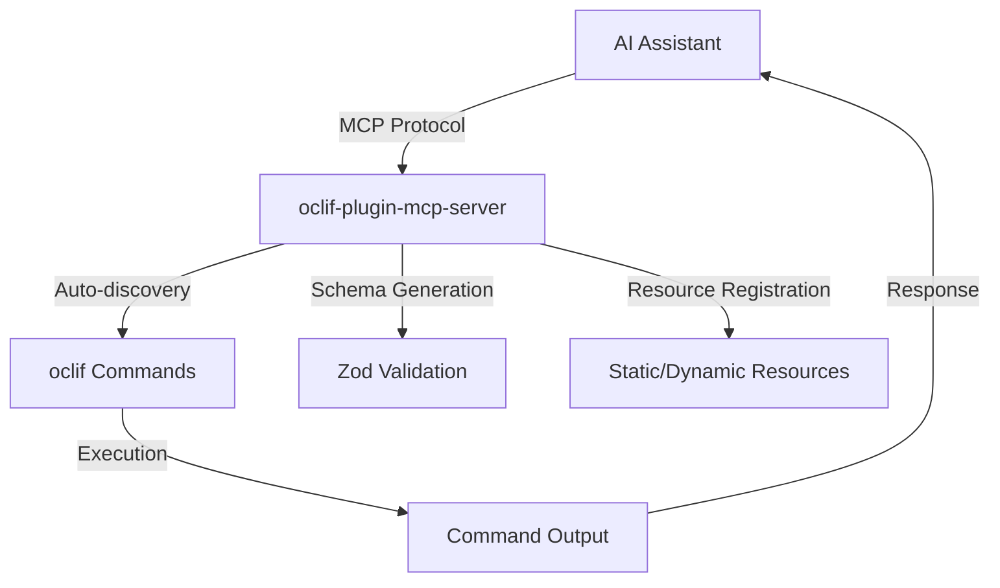

# 🔌 oclif-plugin-mcp-server

> Transform any oclif CLI into an MCP (Model Context Protocol) server for seamless AI assistant integration

[](https://oclif.io)
[](https://npmjs.org/package/oclif-plugin-mcp-server)
[](https://npmjs.org/package/oclif-plugin-mcp-server)
[](https://github.com/npjonath/oclif-plugin-mcp-server/blob/main/LICENSE)

This plugin automatically converts your oclif CLI commands into an MCP server, allowing AI assistants like Claude, ChatGPT, and Cursor to discover and execute your CLI tools naturally through conversation.

## What is MCP?

The **Model Context Protocol (MCP)** is an open standard that enables AI assistants to securely connect to external data sources and tools. With MCP, your CLI becomes a first-class citizen in AI workflows, allowing assistants to:

- 🔍 **Discover** your commands automatically
- ✅ **Validate** inputs using type-safe schemas
- 🚀 **Execute** commands with proper error handling
- 📊 **Access** resources and documentation

<!-- toc -->

- [🔌 oclif-plugin-mcp-server](#-oclif-plugin-mcp-server)
- [Install the plugin](#install-the-plugin)
- [Start the MCP server](#start-the-mcp-server)
- [Set custom log level for npm operations](#set-custom-log-level-for-npm-operations)
- [Set custom npm registry](#set-custom-npm-registry)
- [Your existing CLI](#your-existing-cli)
- [After MCP integration, AI can use these naturally:](#after-mcp-integration-ai-can-use-these-naturally)
- ["Deploy my-app to production with force flag"](#deploy-my-app-to-production-with-force-flag)
- ["Show me the current status in JSON format"](#show-me-the-current-status-in-json-format)
- ["Get the last 100 log entries"](#get-the-last-100-log-entries)
<!-- tocstop -->

## 🚀 Features

- **🔍 Auto-discovery**: Automatically discovers and exposes oclif commands as MCP tools
- **📝 Schema Generation**: Converts oclif arguments and flags to Zod schemas for type-safe execution
- **📊 Resource Support**: Register static and dynamic resources for AI context
- **🛡️ Error Handling**: Graceful error handling with detailed feedback
- **⚡ Zero Configuration**: Works out-of-the-box with any oclif CLI
- **🔧 Flexible**: Support for both static and dynamic resource registration

## 📦 Installation

### As a Plugin at runtime (require oclif-plugin-plugin package configured in your CLI)

```bash
# Install the plugin
your-cli plugins install oclif-plugin-mcp-server

# the following commands should be available in your CLI.
your-cli mcp

# Configure your IDE / AI Assistant to use it (see Configure AI Assistant section below)
```

### Embed plugin in your CLI code

Follow instruction on oclif documentation to install plugin in your CLI (usually inside package.json)

## 🎯 Quick Start

### 1. Configure AI Assistant

Add your CLI to your AI assistant's MCP configuration:

#### Cursor (cursor_settings.json)

```json
{
  "mcpServers": {
    "your-cli": {
      "command": "your-cli",
      "args": ["mcp"],
      "env": {}
    }
  }
}
```

#### Claude Desktop (claude_desktop_config.json)

```json
{
  "mcpServers": {
    "your-cli": {
      "command": "your-cli",
      "args": ["mcp"]
    }
  }
}
```

#### For local development with this plugin

1. build your cli
2. generate the manifest using npx oclif manifest
3. update your cursor mcp json file with

```json
{
  "mcpServers": {
    "your-cli-dev": {
      "command": "node <path_to_project_folder>/bin/dev.js",
      "args": ["mcp"]
    }
  }
}
```

### 2. Start Chatting

Your AI assistant can now discover and use your CLI commands:

```
👤 "Deploy my-app to staging"
🤖 "I'll deploy your application to staging using the deploy command."

   Executing: deploy my-app --environment staging
   ✅ Deploying my-app to staging
   Deployment completed successfully!
```

## 📚 Advanced Usage

### Disable Commands from MCP autodiscovery

Add the `disableMCP` property to commands you want to remove from the MCP autodiscovery:

```typescript
// src/commands/deploy.ts
import {Command, Flags} from '@oclif/core'

export default class MyCommand extends Command {
  static description = 'Deploy your application'
  static disableMCP = true // 👈 disable this command for MCP autodiscovery

  // ... oclif flags and args declaration here

  async run() {
    const {args, flags} = await this.parse(Deploy)
    // ... oclif commands logic here
  }
}
```

### Custom Tool IDs

Override the default tool ID generation:

```typescript
export default class MyCommand extends Command {
  // by default each commands are auto discover by the mcp server.
  static toolId = 'custom-tool-name' // Custom MCP tool identifier
}
```

### Declare MCP Resources

MCP resources provide additional context for your MCP command.
Resources are currently scoped to each command.

You can register a resource in the following ways:

- statically
- dynamically (by providing a handler method)
- instance

```typescript
export default class ConfigCommand extends Command {
  // Option 1: static ressource (reserved variable name)
  static mcpResources = [
    {
      uri: 'config://app-settings',
      name: 'Application Settings',
      description: 'Current application configuration',
      content: JSON.stringify(
        {
          version: '1.0.0',
          environment: 'production',
          features: ['auth', 'logging'],
        },
        null,
        2,
      ),
      mimeType: 'application/json',
    },
  ]

  // Option 2: Static method for dynamic resources (reserved method name)
  static async getMcpResources() {
    return [
      {
        uri: 'status://runtime',
        name: 'Runtime Status',
        description: 'Current system status',
        handler: async () => {
          const status = await this.getSystemStatus()
          return JSON.stringify(status, null, 2)
        },
      },
    ]
  }

  // Option 3: Instance method for dynamic resources (reserved method name)
  async getMcpResources() {
    return [
      {
        uri: 'logs://recent',
        name: 'Recent Logs',
        description: 'Last 100 log entries',
        handler: () => this.getRecentLogs(),
      },
    ]
  }

  private async getSystemStatus() {
    // example computed business resources...
  }

  private async getRecentLogs() {
    // example computed business resources...
  }
}
```

### Command Filtering

The MCP server automatically filters commands based on:

- `hidden: false` - Command must not be hidden
- `disableMCP: true` - Command must not disallow MCP (default: false)
- Not the MCP command itself

## 🏗️ Architecture



## 📋 Examples

### Real-world CLI Integration

```bash
# Your existing CLI
my-cli deploy my-app --environment production --force
my-cli status --format json
my-cli logs --tail 100

# After MCP integration, AI can use these naturally:
# "Deploy my-app to production with force flag"
# "Show me the current status in JSON format"
# "Get the last 100 log entries"
```

## 🤝 Contributing

We welcome contributions! Please see our [Contributing Guide](CONTRIBUTING.md) for details.

### Development Setup

```bash
git clone https://github.com/npjonath/oclif-plugin-mcp-server.git
cd plugin-mcp-server
yarn
yarn run build
```

### Testing

```bash
yarn test
yarn lint
```

## 📄 License

This project is licensed under the MIT License - see the [LICENSE](LICENSE) file for details.

MIT © [Jonathan Jot](https://github.com/npjonath/oclif-plugin-mcp-server)

## 🙏 Acknowledgments

- [oclif](https://oclif.io/) - The Open CLI Framework
- [Model Context Protocol](https://modelcontextprotocol.io/) - Connecting AI assistants to tools
- [Anthropic](https://anthropic.com/) - For driving MCP adoption

---

**Made with ❤️ for the AI-powered CLI future**
