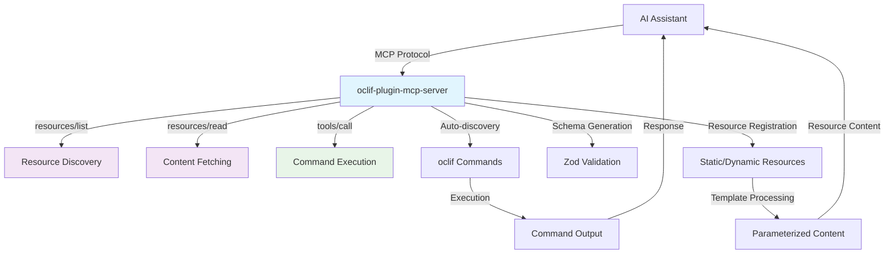
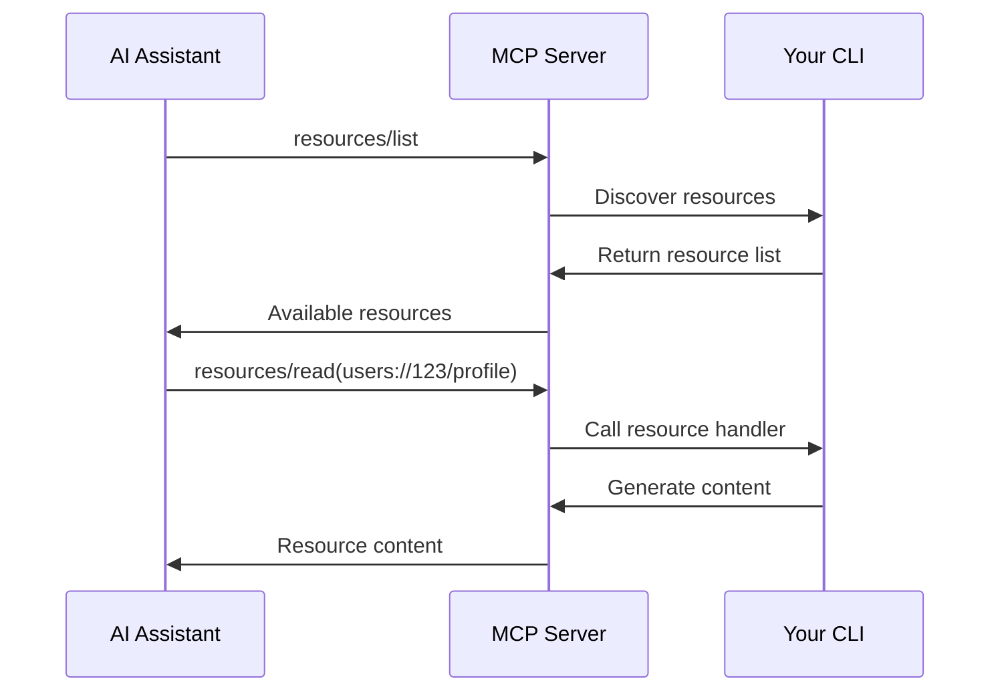

# 🔌 oclif-plugin-mcp-server

> Transform any oclif CLI into a **fully MCP-compliant** server for seamless AI assistant integration

[](https://oclif.io)
[](https://modelcontextprotocol.io)
[](https://npmjs.org/package/oclif-plugin-mcp-server)
[](https://npmjs.org/package/oclif-plugin-mcp-server)
[](https://github.com/npjonath/oclif-plugin-mcp-server/blob/main/LICENSE)

This plugin automatically converts your oclif CLI commands into a **fully MCP-compliant server**, implementing the [official Model Context Protocol specification](https://modelcontextprotocol.io/docs/concepts/resources). It allows AI assistants like Claude, ChatGPT, and Cursor to discover and execute your CLI tools naturally through conversation.

## ✨ What's New

🎉 **Fully MCP-Compliant**: Now implements the official [Model Context Protocol](https://modelcontextprotocol.io) specification with:

- ✅ **`resources/list`** endpoint for resource discovery
- ✅ **`resources/read`** endpoint for on-demand content fetching
- ✅ **ResourceTemplate** support for dynamic resources with parameters
- ✅ **Proper content separation** following MCP best practices
- ✅ **Type-safe resource handlers** with full metadata support

## What is MCP?

The **Model Context Protocol (MCP)** is an open standard that enables AI assistants to securely connect to external data sources and tools. With MCP, your CLI becomes a first-class citizen in AI workflows, allowing assistants to:

- 🔍 **Discover** your commands and resources automatically
- ✅ **Validate** inputs using type-safe schemas
- 🚀 **Execute** commands with proper error handling
- 📊 **Access** resources with lazy loading and proper metadata
- 🔒 **Secure** interactions through standardized protocols

## 🚀 Features

- **🔍 Auto-discovery**: Automatically discovers and exposes oclif commands as MCP tools
- **📝 Schema Generation**: Converts oclif arguments and flags to Zod schemas for type-safe execution
- **📊 MCP-Compliant Resources**: Full support for static and dynamic resources following MCP specification
- **⚡ Resource Templates**: Support for parameterized resources with `{parameter}` syntax
- **🎯 Prompt Templates**: Reusable prompt templates with argument validation and handlers
- **🌳 Workspace Roots**: Automatic CLI working directory registration as MCP root
- **🔄 Lazy Loading**: Resources are fetched on-demand through proper MCP endpoints
- **🛡️ Error Handling**: Graceful error handling with detailed feedback
- **⚙️ Zero Configuration**: Works out-of-the-box with any oclef CLI
- **📋 Standards Compliant**: Implements the official MCP specification

## 📦 Installation

### From GitHub (Recommended)

```bash
# Install directly from GitHub (requires oclif-plugin-plugins)
your-cli plugins install npjonath/oclif-plugin-mcp-server

# Verify installation
your-cli mcp --help
```

### Embed plugin in your CLI code

Add to your CLI's `package.json`:

```json
{
  "dependencies": {
    "oclif-plugin-mcp-server": "latest"
  },
  "oclif": {
    "plugins": ["oclif-plugin-mcp-server"]
  }
}
```

## 🎯 Quick Start

### 1. Configure AI Assistant

Add your CLI to your AI assistant's MCP configuration:

#### Cursor (cursor_settings.json)

```json
{
  "mcpServers": {
    "your-cli": {
      "command": "your-cli",
      "args": ["mcp"],
      "env": {}
    }
  }
}
```

#### Claude Desktop (claude_desktop_config.json)

```json
{
  "mcpServers": {
    "your-cli": {
      "command": "your-cli",
      "args": ["mcp"]
    }
  }
}
```

#### For local development with this plugin

1. Build your CLI: `yarn build`
2. Generate manifest: `npx oclif manifest`
3. Update your MCP configuration:

```json
{
  "mcpServers": {
    "your-cli-dev": {
      "command": "node <path_to_project_folder>/bin/dev.js",
      "args": ["mcp"]
    }
  }
}
```

### 2. Start Chatting

Your AI assistant can now discover and use your CLI commands and resources:

```
👤 "Deploy my-app to staging and show me the deployment logs"
🤖 "I'll deploy your application to staging and fetch the deployment logs."

   Executing: deploy my-app --environment staging
   ✅ Deploying my-app to staging

   Fetching resource: logs://deployment/my-app
   📊 Deployment completed successfully!
   🔍 Logs: [deployment details...]
```

## 📚 Advanced Usage

### Disable Commands from MCP autodiscovery

Add the `disableMCP` property to commands you want to exclude:

```typescript
// src/commands/deploy.ts
import {Command, Flags} from '@oclif/core'

export default class MyCommand extends Command {
  static description = 'Deploy your application'
  static disableMCP = true // 👈 disable this command for MCP autodiscovery

  async run() {
    const {args, flags} = await this.parse(Deploy)
    // ... command logic
  }
}
```

### Custom Tool IDs

Override the default tool ID generation:

```typescript
export default class MyCommand extends Command {
  static toolId = 'custom-tool-name' // Custom MCP tool identifier
}
```

### Tool Annotations

Add MCP-compliant tool annotations to provide AI assistants with metadata about your command's behavior:

```typescript
import {Command} from '@oclif/core'

export default class DeployCommand extends Command {
  static description = 'Deploy your application to production'

  // Specify tool behavior annotations following MCP specification
  static mcpAnnotations = {
    readOnlyHint: false, // This command modifies the environment
    destructiveHint: true, // This operation may be destructive
    idempotentHint: false, // Multiple calls may have different effects
    openWorldHint: true, // Interacts with external systems (deployment)
  }

  async run() {
    // ... deployment logic
  }
}

export default class StatusCommand extends Command {
  static description = 'Get application status'

  static mcpAnnotations = {
    readOnlyHint: true, // This command only reads data
    destructiveHint: false, // Safe operation
    idempotentHint: true, // Multiple calls return same result
    openWorldHint: true, // May check external systems
  }

  async run() {
    // ... status check logic
  }
}
```

### 📊 MCP-Compliant Resources

Resources provide contextual data to AI assistants following the official MCP specification. Resources are automatically discoverable through the `resources/list` endpoint and fetched on-demand via `resources/read`.

#### Static Resources

Perfect for configuration, documentation, or fixed data:

```typescript
export default class ConfigCommand extends Command {
  static mcpResources = [
    {
      uri: 'config://app-settings',
      name: 'Application Settings',
      description: 'Current application configuration',
      content: JSON.stringify(
        {
          version: '1.0.0',
          environment: 'production',
          features: ['auth', 'logging'],
        },
        null,
        2,
      ),
      mimeType: 'application/json',
    },
  ]
}
```

#### Dynamic Resources with Parameters

Use `{parameter}` syntax for parameterized resources:

```typescript
export default class UserCommand extends Command {
  static mcpResources = [
    {
      uri: 'users://{userId}/profile',
      name: 'User Profile',
      description: 'User profile information',
      handler: 'getUserProfile', // Method name on class
      mimeType: 'application/json',
    },
  ]

  // Handler method receives parameters from URI
  async getUserProfile() {
    // Access to this.userId from URI parameter
    const user = await this.fetchUser(this.userId)
    return JSON.stringify(user, null, 2)
  }
}
```

#### Dynamic Resources via Static Methods

Generate resources programmatically:

```typescript
export default class StatusCommand extends Command {
  // Static method for dynamic resource generation
  static async getMcpResources() {
    return [
      {
        uri: 'status://runtime',
        name: 'Runtime Status',
        description: 'Current system status',
        handler: async () => {
          const status = await this.getSystemStatus()
          return JSON.stringify(status, null, 2)
        },
        mimeType: 'application/json',
      },
    ]
  }

  private static async getSystemStatus() {
    return {
      uptime: process.uptime(),
      memory: process.memoryUsage(),
      timestamp: new Date().toISOString(),
    }
  }
}
```

#### Instance Method Resources

Resources that need access to command instance:

```typescript
export default class LogsCommand extends Command {
  // Instance method for dynamic resources
  async getMcpResources() {
    return [
      {
        uri: 'logs://recent/{count}',
        name: 'Recent Logs',
        description: 'Last N log entries',
        handler: () => this.getRecentLogs(),
        mimeType: 'text/plain',
      },
    ]
  }

  private async getRecentLogs() {
    // Access to command instance and configuration
    return await this.fetchLogs(this.config.logLevel)
  }
}
```

### Resource Handler Patterns

```typescript
export default class ExampleCommand extends Command {
  static mcpResources = [
    // String content
    {
      uri: 'example://static',
      name: 'Static Content',
      content: 'Direct string content',
    },

    // Function handler
    {
      uri: 'example://dynamic',
      name: 'Dynamic Content',
      handler: async () => {
        return `Generated at: ${new Date().toISOString()}`
      },
    },

    // Method name reference
    {
      uri: 'example://method',
      name: 'Method Handler',
      handler: 'getMethodContent', // Calls this.getMethodContent()
    },
  ]

  async getMethodContent() {
    return 'Content from method'
  }
}
```

### 🎯 MCP-Compliant Prompts

Prompts provide reusable templates that help AI assistants interact with your CLI more effectively. They follow the [official MCP specification](https://modelcontextprotocol.io/docs/concepts/prompts) using `prompts/list` and `prompts/get` endpoints.

#### How Prompts Work

The plugin automatically implements the MCP prompts protocol:

1. **Discovery**: AI assistants call `prompts/list` to discover available prompts
2. **Execution**: AI assistants call `prompts/get` with prompt name and arguments
3. **Response**: Prompts return structured messages for LLM processing

#### Static Prompts

Define reusable prompt templates on your command classes:

```typescript
export default class AnalyzeCommand extends Command {
  static mcpPrompts = [
    {
      name: 'analyze-logs',
      description: 'Analyze application logs for issues',
      arguments: [
        {
          name: 'logLevel',
          description: 'Log level to focus on (error, warn, info)',
          required: false,
        },
        {
          name: 'timeRange',
          description: 'Time range to analyze (e.g., "last 1 hour")',
          required: true,
        },
      ],
    },
  ]
}
```

#### Dynamic Prompts

Generate prompts programmatically based on current state:

```typescript
export default class DeployCommand extends Command {
  // Static method for dynamic prompt generation
  static async getMcpPrompts() {
    const environments = await this.getAvailableEnvironments()

    return [
      {
        name: 'deploy-with-confirmation',
        description: 'Deploy with safety confirmation prompts',
        arguments: [
          {
            name: 'environment',
            description: `Target environment: ${environments.join(', ')}`,
            required: true,
          },
          {
            name: 'skipChecks',
            description: 'Skip pre-deployment safety checks',
            required: false,
          },
        ],
      },
    ]
  }

  private static async getAvailableEnvironments() {
    return ['development', 'staging', 'production']
  }
}
```

#### Prompts with Custom Handlers

Create prompts that generate dynamic responses:

```typescript
export default class StatusCommand extends Command {
  // Instance method for dynamic prompts
  async getMcpPrompts() {
    return [
      {
        name: 'troubleshoot-status',
        description: `Troubleshoot ${this.config.name} status issues`,
        arguments: [
          {
            name: 'component',
            description: 'Specific component to troubleshoot',
            required: false,
          },
        ],
        handler: 'generateTroubleshootingPrompt',
      },
    ]
  }

  async generateTroubleshootingPrompt(args: any) {
    const status = await this.getSystemStatus()

    return {
      description: 'Troubleshooting guidance based on current system status',
      messages: [
        {
          role: 'user',
          content: {
            type: 'text',
            text: `Please help troubleshoot ${args.component || 'the system'}. Current status: ${JSON.stringify(status, null, 2)}`,
          },
        },
      ],
    }
  }

  private async getSystemStatus() {
    return {
      status: 'running',
      uptime: process.uptime(),
      memory: process.memoryUsage(),
    }
  }
}
```

#### MCP Protocol Compliance

The prompts implementation follows the [official MCP specification](https://modelcontextprotocol.io/docs/concepts/prompts):

- ✅ **`prompts/list`** - Lists all available prompts with names, descriptions, and arguments
- ✅ **`prompts/get`** - Executes specific prompts with argument validation
- ✅ **Argument validation** - Ensures required arguments are provided
- ✅ **Handler support** - Function handlers, method references, and defaults
- ✅ **Structured responses** - Returns properly formatted message arrays for LLMs

### 🌳 MCP Roots Support

Roots provide workspace boundaries and context for AI assistants. You can define custom roots or use the automatic default working directory root.

#### Custom Roots

Define custom workspace roots in your commands:

```typescript
export default class WorkspaceCommand extends Command {
  static mcpRoots = [
    {
      name: 'project-root',
      uri: 'file:///path/to/project',
      description: 'Main project directory',
    },
    {
      name: 'config-root',
      uri: 'file:///path/to/config',
      description: 'Configuration files directory',
    },
  ]
}
```

#### Dynamic Roots

Generate roots programmatically:

```typescript
export default class ProjectCommand extends Command {
  // Static method for dynamic root generation
  static async getMcpRoots() {
    const projectPaths = await this.getProjectPaths()

    return projectPaths.map((path) => ({
      name: path.name,
      uri: `file://${path.fullPath}`,
      description: `${path.name} workspace directory`,
    }))
  }

  private static async getProjectPaths() {
    // Your logic to discover project paths
    return [
      {name: 'frontend', fullPath: '/workspace/frontend'},
      {name: 'backend', fullPath: '/workspace/backend'},
    ]
  }
}
```

#### Instance Method Roots

Roots that need access to command instance:

```typescript
export default class EnvironmentCommand extends Command {
  // Instance method for dynamic roots
  async getMcpRoots() {
    const envConfig = this.config.get('environment')

    return [
      {
        name: 'env-root',
        uri: `file://${envConfig.rootPath}`,
        description: `${envConfig.name} environment root directory`,
      },
    ]
  }
}
```

#### Automatic Fallback Root

When no custom roots are defined, the plugin automatically registers your CLI's current working directory:

- **URI**: `file://[current-working-directory]`
- **Name**: "CLI Working Directory"
- **Purpose**: Provides AI assistants with workspace context for file operations

#### Benefits for AI Assistants

- **Workspace Understanding**: AI assistants know the project boundaries
- **File Context**: Better understanding of relative paths and project structure
- **Security**: Clear boundaries for file system access
- **Navigation**: Helps AI assistants understand the project layout
- **Multi-workspace Support**: Support for complex projects with multiple roots

### Command Filtering

The MCP server automatically filters commands:

- ✅ `hidden: false` - Command must not be hidden
- ✅ `disableMCP: true` - Command must not disable MCP (default: false)
- ✅ Not the MCP command itself

## 🏗️ Architecture



## 🔄 MCP Protocol Compliance

This plugin implements the full MCP specification:

| MCP Feature            | Status      | Implementation                                  |
| ---------------------- | ----------- | ----------------------------------------------- |
| **Tools**              | ✅ Complete | All oclif commands auto-discovered as tools     |
| **Tool Annotations**   | ✅ Complete | Support for readOnlyHint, destructiveHint, etc. |
| **Resources**          | ✅ Complete | `resources/list` and `resources/read` endpoints |
| **Static Resources**   | ✅ Complete | Direct URI registration                         |
| **Dynamic Resources**  | ✅ Complete | ResourceTemplate with parameters                |
| **Resource Templates** | ✅ Complete | `{parameter}` syntax support                    |
| **Prompts**            | ✅ Complete | Reusable prompt templates with argument support |
| **Roots**              | ✅ Complete | CLI workspace directory as MCP root             |
| **Content Types**      | ✅ Complete | Proper MIME type handling                       |
| **Error Handling**     | ✅ Complete | Graceful error responses                        |
| **Schema Validation**  | ✅ Complete | Zod schema generation from oclif definitions    |

## 📋 Examples

### Real-world CLI Integration

```bash
# Your existing CLI
my-cli deploy my-app --environment production --force
my-cli status --format json
my-cli logs --tail 100

# After MCP integration, AI can discover and use:
# - Commands: "Deploy my-app to production with force flag"
# - Resources: "Show me the current deployment status"
# - Logs: "Get the last 100 log entries for my-app"
```

### Resource Discovery Flow



## 🤝 Contributing

We welcome contributions! Please see our [Contributing Guide](CONTRIBUTING.md) for details.

### Development Setup

```bash
git clone https://github.com/npjonath/oclif-plugin-mcp-server.git
cd plugin-mcp-server
yarn install
yarn build
```

### Testing

```bash
yarn test        # Run tests
yarn lint        # Check code style
yarn build       # Build the plugin
```

### Testing MCP Compliance

```bash
# Test with MCP Inspector
npx @modelcontextprotocol/inspector your-cli mcp

# Test resource discovery
curl -X POST http://localhost:3000/mcp \
  -H "Content-Type: application/json" \
  -d '{"jsonrpc":"2.0","id":1,"method":"resources/list"}'
```

## 📄 License

This project is licensed under the MIT License - see the [LICENSE](LICENSE) file for details.

MIT © [Jonathan Jot](https://github.com/npjonath/oclif-plugin-mcp-server)

## 🙏 Acknowledgments

- [oclif](https://oclif.io/) - The Open CLI Framework
- [Model Context Protocol](https://modelcontextprotocol.io/) - Official MCP specification
- [Anthropic](https://anthropic.com/) - For developing and promoting MCP
- [MCP TypeScript SDK](https://github.com/modelcontextprotocol/typescript-sdk) - Official MCP implementation

---

**🌟 Now fully MCP-compliant and ready for the AI-powered CLI future!**
