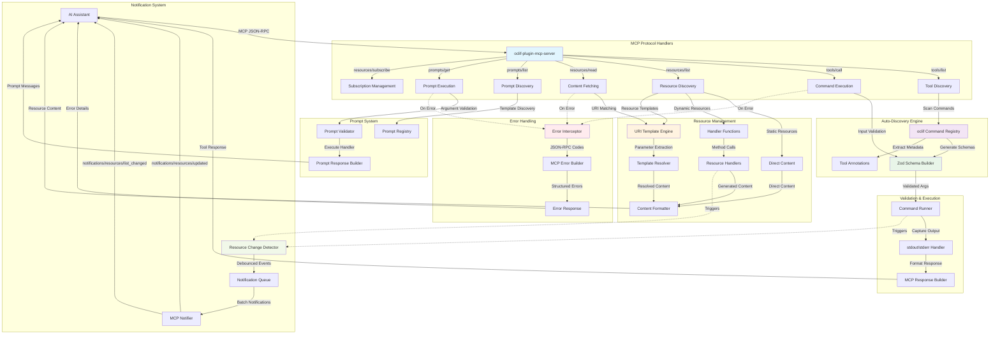
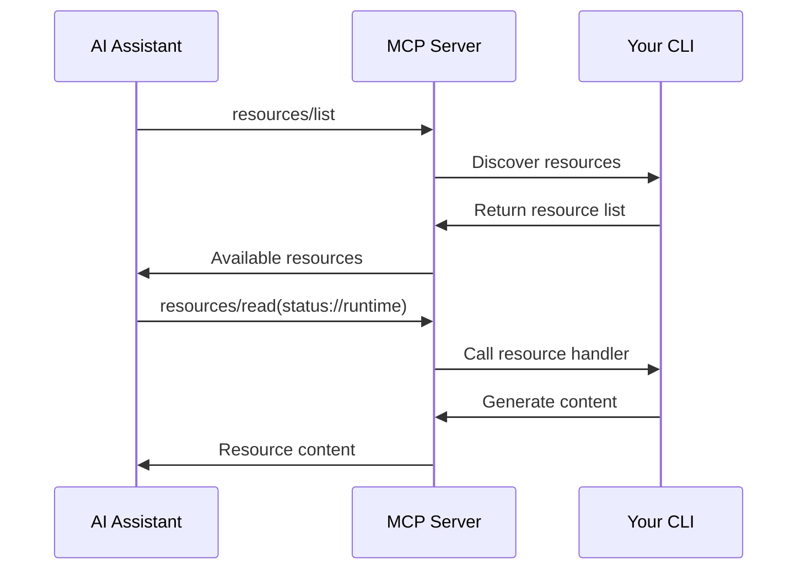

# 🔌 oclif-plugin-mcp-server

> Transform any oclif CLI into a **fully MCP-compliant** server for seamless AI assistant integration

[](https://oclif.io)
[](https://modelcontextprotocol.io)
[](https://npmjs.org/package/oclif-plugin-mcp-server)
[](https://npmjs.org/package/oclif-plugin-mcp-server)
[](https://github.com/npjonath/oclif-plugin-mcp-server/blob/main/LICENSE)

This plugin automatically converts your oclif CLI commands into a **fully MCP-compliant server**, implementing the [official Model Context Protocol specification](https://modelcontextprotocol.io/docs/concepts/resources). It allows AI assistants like Claude, ChatGPT, and Cursor to discover and execute your CLI tools naturally through conversation.

## ✨ What's New

🎉 **MCP-Compliant**: Enhanced implementation with comprehensive MCP specification compliance:

## What is MCP?

The **Model Context Protocol (MCP)** is an open standard that enables AI assistants to securely connect to external data sources and tools. With MCP, your CLI becomes a first-class citizen in AI workflows, allowing assistants to:

- 🔍 **Discover** your commands and resources automatically
- ✅ **Validate** inputs using type-safe schemas
- 🚀 **Execute** commands with proper error handling
- 📊 **Access** resources with lazy loading and proper metadata
- 🔒 **Secure** interactions through standardized protocols

## 🚀 Features

- **🔍 Auto-discovery**: Automatically discovers and exposes oclif commands as MCP tools
- **📝 Schema Generation**: Converts oclif arguments and flags to Zod schemas for type-safe execution
- **📊 MCP-Compliant Resources**: Full support for static and dynamic resources following MCP specification
- **🎯 Prompt Templates**: Reusable prompt templates with argument validation and handlers
- **🌳 Workspace Roots**: Automatic CLI working directory registration as MCP root
- **🔄 Lazy Loading**: Resources are fetched on-demand through proper MCP endpoints
- **🛡️ Error Handling**: Graceful error handling with detailed feedback and proper JSON-RPC error codes
- **⚙️ Zero Configuration**: Works out-of-the-box with any oclif CLI
- **📋 Standards Compliant**: Implements the official MCP specification
- **✅ Input Validation**: Type-safe argument validation for all commands and prompts
- **🔔 Smart Notifications**: Debounced resource change notifications for optimal performance

## 📦 Installation

### Embed plugin in your CLI code (Recommended)

Add to your CLI's `package.json`:

```json
{
  "dependencies": {
    "oclif-plugin-mcp-server": "latest"
  },
  "oclif": {
    "plugins": ["oclif-plugin-mcp-server"]
  }
}
```

### From GitHub

```bash
# Install directly from GitHub (requires oclif-plugin-plugins)
your-cli plugins install npjonath/oclif-plugin-mcp-server

# Verify installation
your-cli mcp --help
```

## 🎯 Quick Start

### 1. Configure AI Assistant

Add your CLI to your AI assistant's MCP configuration:

#### Cursor (mcp.json)

```json
{
  "mcpServers": {
    "your-cli": {
      "command": "your-cli",
      "args": ["mcp"],
      "env": {}
    }
  }
}
```

#### Claude Desktop

```json
{
  "mcpServers": {
    "your-cli": {
      "command": "your-cli",
      "args": ["mcp"]
    }
  }
}
```

#### For local development with this plugin

1. Build your CLI: `yarn build`
2. Generate manifest: `npx oclif manifest`
3. Update your MCP configuration:

```json
{
  "mcpServers": {
    "your-cli-dev": {
      "command": "node <path_to_project_folder>/bin/dev.js",
      "args": ["mcp"]
    }
  }
}
```

### 2. Start Chatting

Your AI assistant can now discover and use your CLI commands and resources:

```
👤 "Deploy my-app to staging and show me the deployment logs"
🤖 "I'll deploy your application to staging and fetch the deployment logs."

   Executing: deploy my-app --environment staging
   ✅ Deploying my-app to staging

   Fetching resource: logs://deployment/my-app
   📊 Deployment completed successfully!
   🔍 Logs: [deployment details...]
```

## 🔒 Security Considerations

This plugin exposes your CLI commands to AI assistants through the MCP protocol. Consider these security aspects:

### Trust Boundaries

- **Local Development**: When running locally, the plugin operates in your user context with your permissions
- **Production Use**: Only expose commands that are safe for AI assistants to execute
- **Sensitive Operations**: Use the `disableMCP` flag for commands that perform sensitive operations

### Command Safety

```typescript
export default class SensitiveCommand extends Command {
  static description = 'This command performs sensitive operations'
  static disableMCP = true // 🔒 Exclude from MCP exposure

  async run() {
    // Sensitive operations that shouldn't be exposed to AI
  }
}
```

### Recommended Practices

- ✅ **Review exposed commands** before deployment
- ✅ **Use tool annotations** to clearly mark destructive operations
- ✅ **Implement proper validation** in your command handlers
- ✅ **Monitor MCP usage** in production environments
- ⚠️ **Avoid exposing commands** that modify system-level configurations
- ⚠️ **Be cautious with file operations** that could affect sensitive data

## 📚 Advanced Usage

### Custom Tool IDs

Override the default tool ID generation:

```typescript
export default class MyCommand extends Command {
  static toolId = 'custom-tool-name' // Custom MCP tool identifier
}
```

### Tool Annotations

Add MCP-compliant tool annotations to provide AI assistants with metadata about your command's behavior:

```typescript
import {Command} from '@oclif/core'

export default class DeployCommand extends Command {
  static description = 'Deploy your application to production'

  // Specify tool behavior annotations following MCP specification
  static mcpAnnotations = {
    readOnlyHint: false, // This command modifies the environment
    destructiveHint: true, // This operation may be destructive
    idempotentHint: false, // Multiple calls may have different effects
    openWorldHint: true, // Interacts with external systems (deployment)
  }

  async run() {
    // ... deployment logic
  }
}

export default class StatusCommand extends Command {
  static description = 'Get application status'

  static mcpAnnotations = {
    readOnlyHint: true, // This command only reads data
    destructiveHint: false, // Safe operation
    idempotentHint: true, // Multiple calls return same result
    openWorldHint: true, // May check external systems
  }

  async run() {
    // ... status logic
  }
}
```

### Enhanced Prompt Templates

Create prompts with advanced argument validation:

```typescript
import {Command} from '@oclif/core'
import {z} from 'zod'

export default class AnalyzeCommand extends Command {
  static description = 'Analyze code and provide insights'

  // Define prompts with custom validation schemas
  static mcpPrompts = [
    {
      name: 'code-review',
      description: 'Review code for best practices and potential issues',
      arguments: [
        {name: 'filePath', required: true, description: 'Path to the file to review'},
        {name: 'severity', required: false, description: 'Minimum severity level'},
      ],
      // Custom Zod schema for advanced validation
      argumentSchema: z.object({
        filePath: z.string().min(1, 'File path is required'),
        severity: z.enum(['low', 'medium', 'high']).default('medium'),
        includePerformance: z.boolean().default(false),
      }),
      handler: 'handleCodeReview', // Method name to call
    },
  ]

  async handleCodeReview(args: {filePath: string; severity: string; includePerformance: boolean}) {
    // Custom prompt handler with validated arguments
    return {
      description: `Code review for ${args.filePath}`,
      messages: [
        {
          role: 'assistant' as const,
          content: {
            type: 'text' as const,
            text: `I'll review the file "${args.filePath}" for ${args.severity} and above issues.${
              args.includePerformance ? ' Including performance analysis.' : ''
            }`,
          },
        },
      ],
    }
  }
}

  async run() {
    // ... status check logic
  }
}
```

### 📊 MCP-Compliant Resources

Resources provide contextual data to AI assistants following the [official MCP specification](https://modelcontextprotocol.io/docs/concepts/resources). Resources are automatically discoverable through the `resources/list` endpoint and fetched on-demand via `resources/read`. Our implementation includes **100% MCP compliance** with:

- ✅ **Direct Resources** - Static resources with `uri`, `name`, `description`, `mimeType`, and `size` fields
- ✅ **Resource Templates** - Dynamic resources using RFC 6570 URI templates with `uriTemplate` field
- ✅ **URI Template Resolution** - Automatic parameter extraction and resolution (e.g., `users://profile/{userId}`)
- ✅ **Binary Resources** - Support for both `text` and `blob` (base64) content types
- ✅ **Multiple Resource Returns** - Single `resources/read` can return multiple resources
- ✅ **Resource Subscriptions** - Full subscription tracking via `resources/subscribe`/`resources/unsubscribe`
- ✅ **Real-time Notifications** - Actual `notifications/resources/updated` and `notifications/resources/list_changed`
- ✅ **URI Generation** - Public API for programmatic URI creation from templates
- ✅ **Server Capabilities** - Proper capabilities declaration with subscription support

#### Static Resources

Perfect for configuration, documentation, or fixed data:

```typescript
export default class ConfigCommand extends Command {
  static mcpResources = [
    {
      uri: 'config://app-settings',
      name: 'Application Settings',
      description: 'Current application configuration',
      content: JSON.stringify(
        {
          version: '1.0.0',
          environment: 'production',
          features: ['auth', 'logging'],
        },
        null,
        2,
      ),
      mimeType: 'application/json',
      size: 98, // Optional: size in bytes for better resource management
    },
  ]
}
```

#### Resource Templates

Use URI templates following RFC 6570 for dynamic resource patterns:

```typescript
export default class UserCommand extends Command {
  static mcpResourceTemplates = [
    {
      uriTemplate: 'users://profile/{userId}',
      name: 'User Profile Template',
      description: 'Access user profiles by ID using users://profile/123',
      mimeType: 'application/json',
    },
    {
      uriTemplate: 'files://document/{docId}/content',
      name: 'Document Content Template',
      description: 'Access document content by ID using files://document/abc/content',
      mimeType: 'text/plain',
    },
  ]

  // Dynamic templates via methods
  static async getMcpResourceTemplates() {
    return [
      {
        uriTemplate: 'logs://{service}/recent',
        name: 'Service Logs Template',
        description: 'Access recent logs for any service using logs://api/recent',
        mimeType: 'text/plain',
      },
    ]
  }
}
```

#### Dynamic Resources with Function Handlers

Use function handlers for dynamic content generation:

```typescript
export default class UserCommand extends Command {
  static mcpResources = [
    {
      uri: 'users://profile-info',
      name: 'User Profile',
      description: 'User profile information',
      handler: 'getUserProfile', // Method name on class
      mimeType: 'application/json',
    },
  ]

  // Handler method generates dynamic content
  async getUserProfile() {
    const user = await this.fetchUserData()
    return JSON.stringify(user, null, 2)
  }

  private async fetchUserData() {
    // Your logic to fetch user data
    return {
      id: '123',
      name: 'John Doe',
      email: 'john@example.com',
    }
  }
}
```

#### Dynamic Resources via Static Methods

Generate resources programmatically:

```typescript
export default class StatusCommand extends Command {
  // Static method for dynamic resource generation
  static async getMcpResources() {
    return [
      {
        uri: 'status://runtime',
        name: 'Runtime Status',
        description: 'Current system status',
        handler: async () => {
          const status = await this.getSystemStatus()
          return JSON.stringify(status, null, 2)
        },
        mimeType: 'application/json',
      },
    ]
  }

  private static async getSystemStatus() {
    return {
      uptime: process.uptime(),
      memory: process.memoryUsage(),
      timestamp: new Date().toISOString(),
    }
  }
}
```

#### Instance Method Resources

Resources that need access to command instance:

```typescript
export default class LogsCommand extends Command {
  // Instance method for dynamic resources
  async getMcpResources() {
    return [
      {
        uri: 'logs://recent-entries',
        name: 'Recent Logs',
        description: 'Recent log entries',
        handler: () => this.getRecentLogs(),
        mimeType: 'text/plain',
      },
    ]
  }

  private async getRecentLogs() {
    // Access to command instance and configuration
    return await this.fetchLogs(this.config.logLevel)
  }

  private async fetchLogs(logLevel: string) {
    // Your logic to fetch logs
    return `Recent logs at ${logLevel} level:\n2024-01-01 10:00:00 INFO: Application started\n2024-01-01 10:01:00 DEBUG: Processing request`
  }
}
```

### Resource Handler Patterns

```typescript
export default class ExampleCommand extends Command {
  static mcpResources = [
    // String content
    {
      uri: 'example://static',
      name: 'Static Content',
      content: 'Direct string content',
    },

    // Function handler
    {
      uri: 'example://dynamic',
      name: 'Dynamic Content',
      handler: async () => {
        return `Generated at: ${new Date().toISOString()}`
      },
    },

    // Method name reference
    {
      uri: 'example://method',
      name: 'Method Handler',
      handler: 'getMethodContent', // Calls this.getMethodContent()
    },
  ]

  async getMethodContent() {
    return 'Content from method'
  }
}
```

#### Binary Resources and URI Templates

Advanced resource patterns with full MCP compliance:

```typescript
export default class AdvancedCommand extends Command {
  // Resource templates for dynamic URI resolution
  static mcpResourceTemplates = [
    {
      uriTemplate: 'users://profile/{userId}',
      name: 'User Profile Template',
      description: 'Access user profiles by ID (e.g., users://profile/123)',
      mimeType: 'application/json',
    },
    {
      uriTemplate: 'files://{category}/{filename}',
      name: 'File Template',
      description: 'Access files by category (e.g., files://docs/readme.txt)',
      mimeType: 'text/plain',
    },
  ]

  // Binary resource example
  static mcpResources = [
    {
      uri: 'images://screenshot',
      name: 'Screenshot',
      handler: 'captureScreen',
      mimeType: 'image/png',
      size: 1024000, // Estimated size in bytes
    },
  ]

  async captureScreen() {
    // Return Buffer for binary content (automatically base64 encoded)
    return Buffer.from('fake-image-data', 'utf8')
  }
}

// AI assistants can now access:
// - users://profile/123 (resolves {userId} to "123")
// - files://docs/readme.txt (resolves {category} to "docs", {filename} to "readme.txt")
// - images://screenshot (returns base64 binary data)
```

#### Resource Notifications and URI Generation

Advanced MCP resource management with real-time updates:

```typescript
export default class NotificationCommand extends Command {
  static mcpResources = [
    {
      uri: 'data://live-metrics',
      name: 'Live System Metrics',
      handler: 'getLiveMetrics',
      mimeType: 'application/json',
    },
  ]

  static mcpResourceTemplates = [
    {
      uriTemplate: 'notifications://alert/{alertId}',
      name: 'Alert Notification Template',
      description: 'Real-time alerts by ID',
      mimeType: 'application/json',
    },
  ]

  async getLiveMetrics() {
    // When this content changes, subscribers get notified
    return JSON.stringify({
      timestamp: new Date().toISOString(),
      cpu: Math.random() * 100,
      memory: Math.random() * 100,
    })
  }
}

// Subscribers automatically receive notifications when resources change
// The server sends proper MCP notifications:
// - notifications/resources/updated (for specific resource changes)
// - notifications/resources/list_changed (when resource list changes)
```

### 🎯 MCP-Compliant Prompts

Prompts provide reusable templates that help AI assistants interact with your CLI more effectively. They follow the [official MCP specification](https://modelcontextprotocol.io/docs/concepts/prompts) using `prompts/list` and `prompts/get` endpoints.

#### How Prompts Work

The plugin automatically implements the MCP prompts protocol:

1. **Discovery**: AI assistants call `prompts/list` to discover available prompts
2. **Execution**: AI assistants call `prompts/get` with prompt name and arguments
3. **Response**: Prompts return structured messages for LLM processing

#### Static Prompts

Define reusable prompt templates on your command classes:

```typescript
export default class AnalyzeCommand extends Command {
  static mcpPrompts = [
    {
      name: 'analyze-logs',
      description: 'Analyze application logs for issues',
      arguments: [
        {
          name: 'logLevel',
          description: 'Log level to focus on (error, warn, info)',
          required: false,
        },
        {
          name: 'timeRange',
          description: 'Time range to analyze (e.g., "last 1 hour")',
          required: true,
        },
      ],
    },
  ]
}
```

#### Dynamic Prompts

Generate prompts programmatically based on current state:

```typescript
export default class DeployCommand extends Command {
  // Static method for dynamic prompt generation
  static async getMcpPrompts() {
    const environments = await this.getAvailableEnvironments()

    return [
      {
        name: 'deploy-with-confirmation',
        description: 'Deploy with safety confirmation prompts',
        arguments: [
          {
            name: 'environment',
            description: `Target environment: ${environments.join(', ')}`,
            required: true,
          },
          {
            name: 'skipChecks',
            description: 'Skip pre-deployment safety checks',
            required: false,
          },
        ],
      },
    ]
  }

  private static async getAvailableEnvironments() {
    return ['development', 'staging', 'production']
  }
}
```

#### Prompts with Custom Handlers

Create prompts that generate dynamic responses:

```typescript
export default class StatusCommand extends Command {
  // Instance method for dynamic prompts
  async getMcpPrompts() {
    return [
      {
        name: 'troubleshoot-status',
        description: `Troubleshoot ${this.config.name} status issues`,
        arguments: [
          {
            name: 'component',
            description: 'Specific component to troubleshoot',
            required: false,
          },
        ],
        handler: 'generateTroubleshootingPrompt',
      },
    ]
  }

  async generateTroubleshootingPrompt(args: any) {
    const status = await this.getSystemStatus()

    return {
      description: 'Troubleshooting guidance based on current system status',
      messages: [
        {
          role: 'user',
          content: {
            type: 'text',
            text: `Please help troubleshoot ${args.component || 'the system'}. Current status: ${JSON.stringify(status, null, 2)}`,
          },
        },
      ],
    }
  }

  private async getSystemStatus() {
    return {
      status: 'running',
      uptime: process.uptime(),
      memory: process.memoryUsage(),
    }
  }
}
```

#### MCP Protocol Compliance

The prompts implementation follows the [official MCP specification](https://modelcontextprotocol.io/docs/concepts/prompts):

- ✅ **`prompts/list`** - Lists all available prompts with names, descriptions, and arguments
- ✅ **`prompts/get`** - Executes specific prompts with argument validation
- ✅ **Argument validation** - Ensures required arguments are provided
- ✅ **Handler support** - Function handlers, method references, and defaults
- ✅ **Structured responses** - Returns properly formatted message arrays for LLMs

### 🌳 MCP Roots Support

Roots provide workspace boundaries and context for AI assistants. You can define custom roots or use the automatic default working directory root.

#### Custom Roots

Define custom workspace roots in your commands:

```typescript
export default class WorkspaceCommand extends Command {
  static mcpRoots = [
    {
      name: 'project-root',
      uri: 'file:///path/to/project',
      description: 'Main project directory',
    },
    {
      name: 'config-root',
      uri: 'file:///path/to/config',
      description: 'Configuration files directory',
    },
  ]
}
```

#### Dynamic Roots

Generate roots programmatically:

```typescript
export default class ProjectCommand extends Command {
  // Static method for dynamic root generation
  static async getMcpRoots() {
    const projectPaths = await this.getProjectPaths()

    return projectPaths.map((path) => ({
      name: path.name,
      uri: `file://${path.fullPath}`,
      description: `${path.name} workspace directory`,
    }))
  }

  private static async getProjectPaths() {
    // Your logic to discover project paths
    return [
      {name: 'frontend', fullPath: '/workspace/frontend'},
      {name: 'backend', fullPath: '/workspace/backend'},
    ]
  }
}
```

#### Instance Method Roots

Roots that need access to command instance:

```typescript
export default class EnvironmentCommand extends Command {
  // Instance method for dynamic roots
  async getMcpRoots() {
    const envConfig = this.config.get('environment')

    return [
      {
        name: 'env-root',
        uri: `file://${envConfig.rootPath}`,
        description: `${envConfig.name} environment root directory`,
      },
    ]
  }
}
```

#### Automatic Fallback Root

When no custom roots are defined, the plugin automatically registers your CLI's current working directory:

- **URI**: `file://[current-working-directory]`
- **Name**: "CLI Working Directory"
- **Purpose**: Provides AI assistants with workspace context for file operations

#### Benefits for AI Assistants

- **Workspace Understanding**: AI assistants know the project boundaries
- **File Context**: Better understanding of relative paths and project structure
- **Security**: Clear boundaries for file system access
- **Navigation**: Helps AI assistants understand the project layout
- **Multi-workspace Support**: Support for complex projects with multiple roots

### Command Filtering

The MCP server automatically filters commands:

- ✅ `hidden: false` - Command must not be hidden
- ✅ `disableMCP: true` - Command must not disable MCP (default: false)
- ✅ `cmdClass.pluginType === 'jit'` - JIT (Just-In-Time) commands are automatically excluded from MCP exposure for security and stability reasons.
- ✅ Not the MCP command itself

## 🏗️ Architecture



## 🔄 MCP Protocol Compliance

This plugin implements the full MCP specification with enhanced compliance features:

| MCP Feature                 | Status      | Implementation                                    |
| --------------------------- | ----------- | ------------------------------------------------- |
| **Tools**                   | ✅ Complete | All oclif commands auto-discovered as tools       |
| **Tool Annotations**        | ✅ Complete | Support for readOnlyHint, destructiveHint, etc.   |
| **Resources**               | ✅ Complete | `resources/list` and `resources/read` endpoints   |
| **Static Resources**        | ✅ Complete | Direct content and URI registration with size     |
| **Dynamic Resources**       | ✅ Complete | Function and method handlers                      |
| **Resource Templates**      | ✅ Complete | RFC 6570 URI templates with automatic resolution  |
| **Binary Resources**        | ✅ Complete | Buffer support with base64 encoding               |
| **URI Resolution**          | ✅ Complete | Parameter extraction from templated URIs          |
| **Multiple Resources**      | ✅ Complete | Single read request can return multiple resources |
| **Resource Updates**        | ✅ Complete | Real-time MCP notifications for resource changes  |
| **URI Generation**          | ✅ Complete | Public API for programmatic URI template creation |
| **Notification System**     | ✅ Complete | Full MCP notification protocol implementation     |
| **Prompts**                 | ✅ Complete | Reusable prompt templates with argument support   |
| **Roots**                   | ✅ Complete | CLI workspace directory as MCP root               |
| **Content Types**           | ✅ Complete | Proper MIME type handling                         |
| **Error Handling**          | ✅ Complete | Graceful error responses                          |
| **Schema Validation**       | ✅ Complete | Zod schema generation from oclif definitions      |
| **Input Validation**        | ✅ Enhanced | Full Zod validation for all tool arguments        |
| **JSON-RPC Errors**         | ✅ Enhanced | Proper MCP error codes (-32xxx) for all errors    |
| **Prompt Validation**       | ✅ Enhanced | Type-safe prompt argument parsing                 |
| **Debounced Notifications** | ✅ Enhanced | Optimized resource change notifications           |
| **Enhanced Prompts**        | ✅ Enhanced | Interactive assistant-style prompt responses      |

## 📋 Examples

### Real-world CLI Integration

```bash
# Your existing CLI
my-cli deploy my-app --environment production --force
my-cli status --format json
my-cli logs --tail 100

# After MCP integration, AI can discover and use:
# - Commands: "Deploy my-app to production with force flag"
# - Resources: "Show me the current deployment status"
# - Logs: "Get the last 100 log entries for my-app"
```

### Resource Discovery Flow



## 🤝 Contributing

We welcome contributions! Please see our [Contributing Guide](CONTRIBUTING.md) for details.

### Development Setup

```bash
git clone https://github.com/npjonath/oclif-plugin-mcp-server.git
cd plugin-mcp-server
yarn install
yarn build
```

### Testing

```bash
yarn test        # Run tests
yarn lint        # Check code style
yarn build       # Build the plugin
```

### Testing MCP Compliance

```bash
# Test with MCP Inspector
npx @modelcontextprotocol/inspector your-cli mcp

# Test resource discovery
curl -X POST http://localhost:3000/mcp \
  -H "Content-Type: application/json" \
  -d '{"jsonrpc":"2.0","id":1,"method":"resources/list"}'
```

## 📄 License

This project is licensed under the MIT License - see the [LICENSE](LICENSE) file for details.

MIT © [Jonathan Jot](https://github.com/npjonath/oclif-plugin-mcp-server)

## 🙏 Acknowledgments

- [oclif](https://oclif.io/) - The Open CLI Framework
- [Model Context Protocol](https://modelcontextprotocol.io/) - Official MCP specification
- [Anthropic](https://anthropic.com/) - For developing and promoting MCP
- [MCP TypeScript SDK](https://github.com/modelcontextprotocol/typescript-sdk) - Official MCP implementation

---

**🌟 Now fully MCP-compliant and ready for the AI-powered CLI future!**
